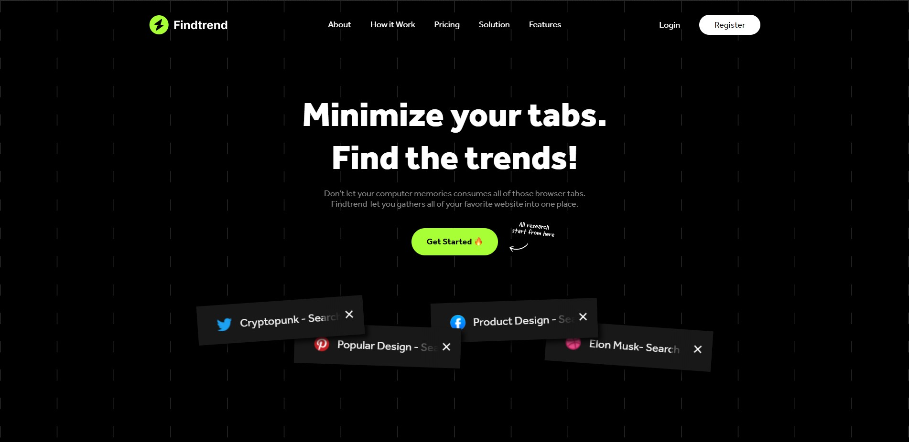

# Odama Findtrend Webflow HTML Template

## Description

Findtrend is odama studio's first project on github based figma shoot, there are still many shortcomings in its development.

We here use webflow as a site builder, you can find a demo of the site [here](https://findtrend.webflow.io/).

## Authors

Contributors names and contact info

- [Rama Sullivan](https://www.linkedin.com/in/aezo27/)
- [Happy Tri Milliarta](https://dribbble.com/milliarta)

## Version History

<!-- - 0.2
  - Various bug fixes and optimizations
  - See [commit change](https://gitlab.com/odama/babyboo/-/commits/main) -->
- 0.1
  - Initial Release

## Odama Social Media

For more information about us.

- [Dribbble](https://dribbble.com/odamastudio)
- [Behance](https://www.behance.net/odamastudio)
- [Instagram](https://www.instagram.com/odamastudio/)
- [Medium](https://medium.com/odama)
- [Linkedin](https://www.linkedin.com/company/odamastudio)
- [E-mail](mailto:hellodama@gmail.com)
